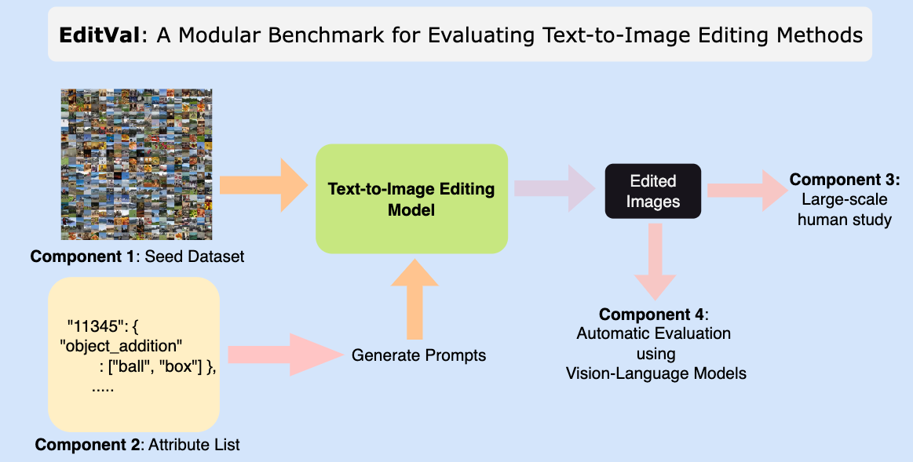
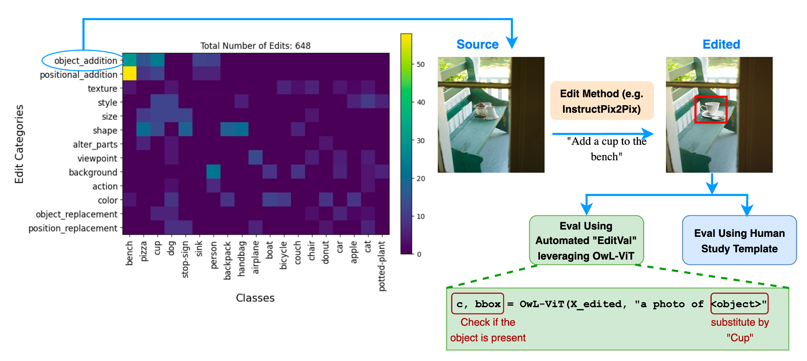
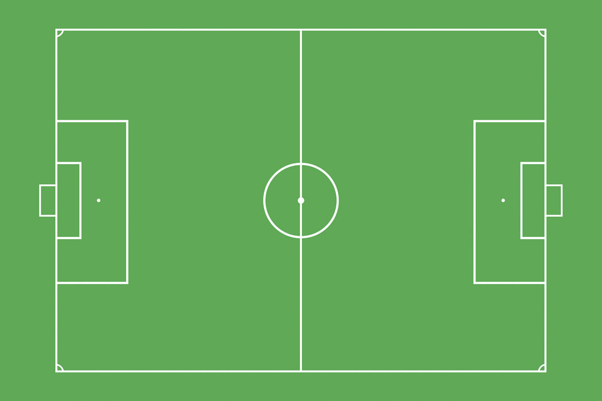

# Overview

We provide four different visualizations about soccer players and games in our dataset. 

<!-- **EDITVAL** is a standardized benchmark for evaluating text-guided image editing methods across diverse edit types, validated through a large-scale human study. 


<br/>



**EDITVAL** consists of the following distinct components:

*   A seed dataset _D_ consisting of carefully selected images from **MS-COCO**. These are the real
images which need to be edited by the different editing methods.
*   An attribute list _A_ which consists of various dimensions in which the edits need to be made on the dataset _D_.
*   An evaluation template and procedure for human study on the edited images.
*   An automated evaluation procedure to check quality of edits using pre-trained vision-language models for a subset of attributes in _A_. 


The attribute list _A_ for ~100 images from MS-COCO can be downloaded from [here](https://drive.google.com/file/d/1PJW7mZnrMAtSJC6yG4g4xIHlu3kwIjm5/view){:target="_blank" rel="noopener"}. The format of the json file is as follows:

```
{
  "class_name" : {
    "image_id": { # image ids from MS-COCO
      "edit_attribute" : {
        "from" : ["initial state of attribute"],
        "to" : ["target states of attribute", ...]}}}
}
```
The complete list of edit attributes for evaluation currently is:


*   **Object Addition:** adding an object to the image.
*   **Object Replacement:** replacing an existing object in the image with another object.
*   **Size:** changing the size of an object.
*   **Position Replacement:** changing the position of an object in the image (e.g., left, center, right).
*   **Positional Addition:** adding an object in a specific position in the image.
*   **Alter Parts:** modifying the details of an object.
*   **Background:** changing the background of the image.
*   **Texture:** changing the texture of an object (e.g., wooden table, polka dot cat).
*   **Color:** changing the color of an object.
*   **Shape:** changing shape of an object (e.g., circle-shaped stop sign)
*   **Action:** changing the action that the main object is performing (e.g., dog running).
*   **Viewpoint:** changing the viewpoint in which the image is taken from (e.g., photo of a dog from above).


## More Details on EditVal Dataset and Pipeline
EditVal benchmark contains 648 unique image-edit operations for 19 classes selected from MS-COCO spanning a variety of real-world edits. Edit operations span simple attribute categories like adding or replacing an object to more complex ones such as changing an action, camera viewpoint or replacing the position of an existing object.

 -->


<head>
    <meta http-equiv="Content-Type" content="text/html; charset=utf-8">
    <link rel="stylesheet" href="./visualizations/matches/style.css">
    <link rel="stylesheet" href="./visualizations/players/style.css">
    <link rel="stylesheet" href="./visualizations/events/style.css">
    <link rel="stylesheet" href="./visualizations/map/style.css">
</head>


# Players

Select the year and player names to see the comparison among the players for that particular year.

<div id="players">


  <div class='player-div'>
    <div id="searchContainer">
        <div class="tag-input" id="tagInput">
            <div class="dropdown">
          <input type="text" id="searchInput" placeholder="Search for players">
          <div class="dropdown-content" id="itemDropdown">
          </div>
          <select class="year-selector" id="yearSelector">
          </select>
        </div>
    </div>
  </div>
  </div>

</div>

 
<script src="//d3js.org/d3.v5.min.js"></script>
<script src="./visualizations/players/main.js"></script>

# High-Level Match Analysis


<div id="matches">
  <div class="match-div" style="margin-left:-250px">
      <!-- <svg width="1300" height="520" style="border: 1px solid #777;"></svg> -->

  </div>
</div>


<script src="./visualizations/matches/d3-tip.js"></script>
<script src="./visualizations/matches/main.js"></script>


<!-- 
The numbers below for the human study are calculated only on the first question of the template, which does not consider the changes to the rest of the image. This has been done in order to keep the results comparable to our automatic evaluation framework. For each instant in the human study, a score of `1.0` is given if the edit is `Adequetly applied` or `Perfectly applied`, and a score of `0.0` otherwise.


<h2 style="text-align:center;">Human Study</h2>
<table id="human_study_table" style="overflow:visible;text-align: center;
  display: flex;
  justify-content: center;">
  <tr>
    <th onclick="sortTable(0, 'human_study_table')" style="cursor: pointer;">Method</th>
    <th onclick="sortTable(1, 'human_study_table')" style="cursor: pointer;">Object Addition</th>
    <th onclick="sortTable(2, 'human_study_table')" style="cursor: pointer;">Object Replacement</th>
    <th onclick="sortTable(3, 'human_study_table')" style="cursor: pointer;">Position Replacement</th>
    <th onclick="sortTable(4, 'human_study_table')" style="cursor: pointer;">Positional Addition</th>
    <th onclick="sortTable(5, 'human_study_table')" style="cursor: pointer;">Size</th>
    <th onclick="sortTable(6, 'human_study_table')" style="cursor: pointer;">Alter Parts</th>
    <th onclick="sortTable(7, 'human_study_table')" style="cursor: pointer;">Average</th>
  </tr>
</table>


<h2 style="text-align:center;">Automatic Evaluation</h2>
<table id="aut_eval_table" style="overflow:visible;text-align: center;
  display: flex;
  justify-content: center;">
  <tr>
    <th onclick="sortTable(0, 'aut_eval_table')" style="cursor: pointer;">Method</th>
    <th onclick="sortTable(1, 'aut_eval_table')" style="cursor: pointer;">Object Addition</th>
    <th onclick="sortTable(2, 'aut_eval_table')" style="cursor: pointer;">Object Replacement</th>
    <th onclick="sortTable(3, 'aut_eval_table')" style="cursor: pointer;">Position Replacement</th>
    <th onclick="sortTable(4, 'aut_eval_table')" style="cursor: pointer;">Positional Addition</th>
    <th onclick="sortTable(5, 'aut_eval_table')" style="cursor: pointer;">Size</th>
    <th onclick="sortTable(6, 'aut_eval_table')" style="cursor: pointer;">Alter Parts</th>
    <th onclick="sortTable(7, 'aut_eval_table')" style="cursor: pointer;">Average</th>
  </tr>
</table> -->


# Events

Search for matches to view their events timeline.

<div id="events">
  <div class="event-div">
    <div class="rectangle"></div>
    <div id="fixedForm">
      <form id="checkboxForm">
          <label><input type="checkbox" name="option" value="goal"> Goals <br></label>
          <label><input type="checkbox" name="option" value="corner"> Corners <br></label>
          <label><input type="checkbox" name="option" value="substitution"> Substitutions  <br></label>
          <label><input type="checkbox" name="option" value="yellow card"> Yellow Cards <br></label>
          <label><input type="checkbox" name="option" value="red card"> Red Cards <br></label>
          <label><input type="checkbox" name="option" value="offside"> Offsides <br> <br></label>
          <button id="fancy-button" type="button" onclick="updateChosenEvents()">Apply</button>
      </form>
    </div>
    <div id="fixedMatchResult">
        <div class="teams">
            <div class="team-name" id="team1">Home Team</div>
            <div class="team-name" id="team2">Away Team</div>
        </div>
        <div class="score" id="scoreboard">? - ?</div>
    </div>
    <div id="searchContainerEvents">
        <div class="tag-inputEvents" id="tagInputEvents">
          <div class="dropdownEvents">
            <input type="text" id="searchInputEvents" placeholder="Search for games">
            <div class="dropdown-contentEvents" id="itemDropdownEvents">
            </div>
          </div>
        </div>
      </div>


  </div>

</div>


<script src="./visualizations/events/events.js"></script>


# Events Map

Search for matches, and select a player from that match, to view their passes. Successful passes are shown with a <span style="color:blue;font-weight:bold">blue</span> arrow, while unsuccessful ones are shown with a <span style="color:red;font-weight:bold">blue</span> arrow.

<div id="map" style="margin-bottom:100px">
  <div class="map-div" >
    <div class="rowMap" style="margin-bottom: 20px;">
      <div class="shapes">  
        <div id="searchContainerMap">
          <div class="tag-inputMap" id="tagInputMap">
            <div class="dropdownMap">
              <input type="text" id="searchInputMap" placeholder="Search for games">
              <div class="dropdown-contentMap" id="itemDropdownMap">
              </div>
            </div>
          </div>
        </div>
      </div>
      <div class="shapes" style="margin-left: 20px;">
        <div id="searchContainerMapPlayer">
            <div class="tag-inputMapPlayer" id="tagInputMapPlayer">
              <div class="dropdownMapPlayer">
                <input type="text" id="searchInputMapPlayer" placeholder="Search for players">
                <div class="dropdown-contentMapPlayer" id="itemDropdownMapPlayer">
                </div>
              </div>
            </div>
          </div>
      </div>
    </div>
    <div style="margin-bottom: 20px;font-size:12px;" id="team1Map">
    </div>
    <div style="margin-bottom: 50px;font-size:12px;" id="team2Map">
    </div>
    <div class="rowMap" style="margin-top:70px">
      <div class="shapes">
        
      </div>
      <div class="shapes">
        
      </div>
      <div class="shapes">
      <svg  id="firstMap" style="position:absolute;left:-835px;top:-100px;width:900px;height:500px">
          <defs> 
            <marker id="arrowhead1" markerWidth="4" markerHeight="3" refX="0" refY="1.5" orient="auto"> 
                <polygon points="0 0, 4 1.5, 0 3" fill="blue"/> 
            </marker> 
            <marker id="arrowhead0" markerWidth="4" markerHeight="3" refX="0" refY="1.5" orient="auto"> 
                <polygon points="0 0, 4 1.5, 0 3" fill="red"/> 
            </marker> 
        </defs>
          <text id="team1half1Name" x="100" y="50" class="small" font-family="Arial" font-size="17" fill="gold" stroke="orange" stroke-width="0.5"></text>
          <text id="team2half1Name" x="100" y="435" class="small" font-family="Arial" font-size="17" fill="blue" stroke="purple" stroke-width="0.5"></text>
          <text id="team2half2Name" x="516" y="50" class="small" font-family="Arial" font-size="17" fill="blue" stroke="purple" stroke-width="0.5"></text>
          <text id="team1half2Name" x="516" y="435" class="small" font-family="Arial" font-size="17" fill="gold" stroke="orange" stroke-width="0.5"></text>
          <text x="317" y="50" class="small" font-family="Arial" font-size="14" fill="black" stroke="black" stroke-width="1.0">1st Half</text>
          <text x="730" y="50" class="small" font-family="Arial" font-size="14" fill="black" stroke="black" stroke-width="1.0">2nd Half</text>
          </svg>
      </div>
    </div>
  </div>
</div>

<script src="./visualizations/map/main.js"></script>


<!-- 
<div id="contact"></div> -->

<!-- 
<script>
function sortTable(n, tableID) {
  var table, rows, switching, i, x, y, shouldSwitch, dir, switchcount = 0;
  table = document.getElementById(tableID);
  switching = true;
  //Set the sorting direction to ascending:
  dir = "desc"; 
  /*Make a loop that will continue until
  no switching has been done:*/
  while (switching) {
    //start by saying: no switching is done:
    switching = false;
    rows = table.rows;
    /*Loop through all table rows (except the
    first, which contains table headers):*/
    for (i = 1; i < (rows.length - 1); i++) {
      //start by saying there should be no switching:
      shouldSwitch = false;
      /*Get the two elements you want to compare,
      one from current row and one from the next:*/
      x = rows[i].getElementsByTagName("TD")[n];
      y = rows[i + 1].getElementsByTagName("TD")[n];
      /*check if the two rows should switch place,
      based on the direction, asc or desc:*/
      if (dir == "asc") {
        if (x.innerHTML.toLowerCase() > y.innerHTML.toLowerCase()) {
          //if so, mark as a switch and break the loop:
          shouldSwitch= true;
          break;
        }
      } else if (dir == "desc") {
        if (x.innerHTML.toLowerCase() < y.innerHTML.toLowerCase()) {
          //if so, mark as a switch and break the loop:
          shouldSwitch = true;
          break;
        }
      }
    }
    if (shouldSwitch) {
      /*If a switch has been marked, make the switch
      and mark that a switch has been done:*/
      rows[i].parentNode.insertBefore(rows[i + 1], rows[i]);
      switching = true;
      //Each time a switch is done, increase this count by 1:
      switchcount ++;      
    } else {
      /*If no switching has been done AND the direction is "asc",
      set the direction to "desc" and run the while loop again.*/
      if (switchcount == 0 && dir == "desc") {
        dir = "asc";
        switching = true;
      }
    }
  }
}
</script> -->
<script src="https://ajax.googleapis.com/ajax/libs/jquery/1.7.1/jquery.min.js"></script>
<script src="https://cdnjs.cloudflare.com/ajax/libs/PapaParse/4.1.2/papaparse.js"></script>
<!-- 
<script>
    function arrayToTable(tableData, tableID) {
        var table = document.getElementById(tableID);
        $(tableData).each(function (i, rowData) {
            let row = table.insertRow(-1);
            $(rowData).each(function (j, cellData) {
                let c = row.insertCell(j);
                if (j != 0) {
                  cellData = Math.round(cellData * 100) / 100;
                }
                c.innerText = cellData
            });
        });
        return table;
    }
    $.ajax({
        type: "GET",
        url: "./human_study_table.csv",
        success: function (data) {
            arrayToTable(Papa.parse(data).data, "human_study_table");
        }
    });
    $.ajax({
        type: "GET",
        url: "./aut_eval_table.csv",
        success: function (data) {
            arrayToTable(Papa.parse(data).data, "aut_eval_table");
        }
    });
</script> -->

